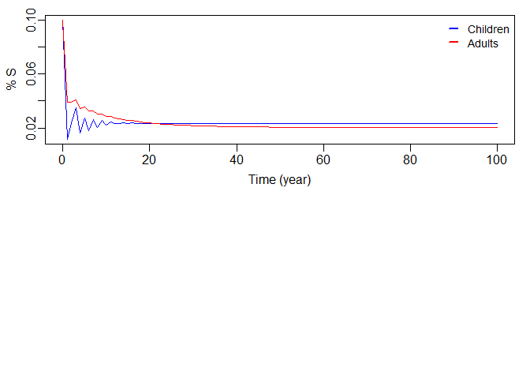

Lab Report 10
================
Chee Kay Cheong
2023-04-01

``` r
knitr::opts_chunk$set(message = FALSE, warning = FALSE)

library(tidyverse)
library(deSolve)
```

### Q1: Run the model using parameters/initial conditions listed in the slides 8-9 for 100 years. Plot the fraction of susceptibles (Si/ni) for the two groups.

Two age groups model:

``` r
SIR2ageGrs = function(t, state, parameters) {
  with(as.list(c(state, parameters)), {
    
    dSC = nu - SC * (betaCC * IC + betaCA * IA) - muC * SC - lC * SC
    dIC = SC * (betaCC * IC + betaCA * IA) - gamma * IC - muC * IC - lC * IC
    dSA = lC * SC - SA * (betaAC * IC + betaAA * IA) - muA * SA
    dIA = lC * IC + SA * (betaAC * IC + betaAA * IA) - gamma * IA - muA * IA
    
    list(c(dSC, dIC, dSA, dIA))
  })
}
```

Parameters & initial conditions:

``` r
# Note all time units are in year here
betaCC = 1100; # transmission rate among children per year
betaCA = betaAC = 110;  # transmission rate between children and adults per year
betaAA = 220; # transmission rate among adults per year
gamma = 1 / (14/365); # recovery rate: 1/ infectious period, infectious period = 2 weeks  

lC = 0.066667; # rate of leaving the children group(aging rate): 1/15 per year

muC = 0; # mortality rate of children
muA = 0.0166667; # mortality rate of adults:  1/(75-15);  mean life expectancy = 75yr; subtract the 15 yrs in youth with 0 death rate

# fraction of population in the two age groups
nC = 0.2;  # % children = 15/75; 
nA = 0.8; # % adults = 1 - nC;
nu = 1/75; # birth rate, per year

# initial susceptibility 
SC0 = 0.1; # initial susceptibility in children 10%
SA0 = 0.1; # initial susceptibility in adults 10%
# initial infectious:
IC0 = 0.0001; # initial infection rate in children 
IA0 = 0.0001; # initial infection rate in adults
# initial recovered:
RC0 = nC - IC0 - SC0; 
RA0 = nA - IA0 - SA0; 

# Parameters and initial conditions
parameters = c(betaCC = betaCC, betaAA = betaAA, betaAC = betaCA, betaCA = betaCA, gamma = gamma, lC = lC, muC = muC, muA = muA, nu = nu)
state = c(SC = SC0, IC = IC0, SA = SA0, IA = IA0)

times = seq(0, 100, by = 1)
```

Run the model.

``` r
sim = ode(y = state, times = times, func = SIR2ageGrs, parms = parameters)
```

Plot the fraction of susceptible (Si/ni) for the two groups

``` r
par(mfrow = c(2, 1), mar = c(3, 3, 1, 1), mgp = c(1.8, 0.5, 0))
  plot(sim[ , 'time'], sim[ , 'SC'], ylab = '% S', xlab = 'Time (year)', type = 'l', col = 'blue', lwd = 1)
  lines(sim[ , 'time'], sim[ , 'SA'], ylab = '% S', xlab = 'Time (year)', type = 'l', col = 'red', lwd = 1)
  legend('topright', cex = 0.9, seg.len = 0.8, legend = c('Children', 'Adults'), lty = c(1, 1), , lwd = c(2, 2), col = c('blue', 'red'), bty = 'n')
```

<!-- -->

### Q2: What is $R_0$ for the entire population? What would the average age of infection be, given this $R_0$ value and a life span of 75 years?

``` r
# set beta matrix
beta = matrix(c(1100, 110, 110, 220), 2, 2) # the beta matrix
nC = 0.2; nA = 0.8;
n = c(nC, nA)      # n is the vector storing the proportion in each group
n.matrix = diag(n, 2, 2)  # matrix related to the population size in each group

gamma = 1/(14/365);

R.matrix = n.matrix %*% beta / gamma

# to see the output of the eigen function:
eigen(R.matrix)
```

    ## eigen() decomposition
    ## $values
    ## [1] 9.481394 5.707647
    ## 
    ## $vectors
    ##           [,1]       [,2]
    ## [1,] 0.6289602 -0.2952418
    ## [2,] 0.7774375  0.9554226

``` r
# To find R0
R0 = eigen(R.matrix)$values[1]

# Average age of infection = Expected life span/R0
A = 75/R0
```

### Q3: What is the force of infection for each of the two groups, when this disease (or the simulation here) reaches **equilibrium**?

``` r
# Force of infection for children group
lambdaCe = ((1 - sim[100, 'SC'])/15) / sim[100, 'SC']

# Force of infection for adult group
lambdaAe = ((sim[100, 'SC'] - sim[100, 'SA'])/60) / sim[100, 'SA']
```

### Q4: What is the force of infection for each of the two groups, given the parameters and initial state variables **at the beginning of the simulation**?

``` r
# Force of infection for children group
lambdaC = ((1 - sim[1, 'SC'])/15) / sim[1, 'SC']

# Force of infection for adult group
lambdaA = ((sim[1, 'SC'] - sim[1, 'SA'])/60) / sim[1, 'SA'] 
```

## Part 2: Vaccination

### Q5: Code a model with 2 age groups and vaccination at birth.

Two age groups model with vaccination at birth:

``` r
SIR2ageVac = function(t, state, parameters) {
  with(as.list(c(state, parameters)), {
    
    dSC = nu*(1-p) - SC*(betaCC*IC + betaCA*IA) - muC*SC - lC*SC
    dIC = SC*(betaCC*IC + betaCA*IA) - gamma*IC - muC*IC - lC*IC
    dRC = nu*p + gamma*IC -muC*RC - lC*RC
    dSA = lC*SC - SA*(betaAC*IC + betaAA*IA) - muA*SA
    dIA = lC*IC + SA*(betaAC*IC + betaAA*IA) - gamma*IA - muA*IA
    dRA = lC*RC + gamma*IA - muA*RA
    
    list(c(dSC, dIC, dRC, dSA, dIA, dRA))
  })
}
```

### Q6: Test your model with *p = 0.5* and the same initial conditions & parameters as in Part 1.

Parameters & initial conditions:

``` r
# Note all time units are in year here
betaCC = 1100; # transmission rate among children per year
betaCA = betaAC = 110;  # transmission rate between children and adults per year
betaAA = 220; # transmission rate among adults per year
gamma = 1 / (14/365); # recovery rate: 1/ infectious period, infectious period = 2 weeks  

lC = 0.066667; # rate of leaving the children group(aging rate): 1/15 per year

muC = 0; # mortality rate of children
muA = 0.0166667; # mortality rate of adults:  1/(75-15);  mean life expectancy = 75yr; subtract the 15 yrs in youth with 0 death rate

# fraction of population in the two age groups
nC = 0.2;  # % children = 15/75; 
nA = 0.8; # % adults = 1 - nC;
nu = 1/75; # birth rate, per year
p = 0.5;  # vaccination rate at birth

# initial susceptibility 
SC0 = 0.1; # initial susceptibility in children 10%
SA0 = 0.1; # initial susceptibility in adults 10%
# initial infectious:
IC0 = 0.0001; # initial infection rate in children 
IA0 = 0.0001; # initial infection rate in adults
# initial recovered:
RC0 = nC - IC0 - SC0; 
RA0 = nA - IA0 - SA0; 

# Parameters and initial conditions
parameters = c(betaCC = betaCC, betaAA = betaAA, betaAC = betaCA, betaCA = betaCA, gamma = gamma, lC = lC, muC = muC, muA = muA, nu = nu, p = 0.5)
state = c(SC = SC0, IC = IC0, RC = RC0, SA = SA0, IA = IA0, RA = RA0)

times = seq(0, 100, by = 1)
```

Run the model.

``` r
sim = ode(y = state, times = times, func = SIR2ageVac, parms = parameters)
```

Plot the fraction of recovered/immune for the two groups.

``` r
par(mfrow = c(2, 1), mar = c(3, 3, 1, 1), mgp = c(1.8, 0.5, 0))
  plot(sim[ , 'time'], sim[ , 'RA'], ylab = '% R', ylim = c(0, 0.8), xlab = 'Time (year)', type = 'l', col = 'red', lwd = 1)
  lines(sim[ , 'time'], sim[ , 'RC'], ylab = '% R', xlab = 'Time (year)', type = 'l', col = 'blue', lwd = 1)
  legend('topright', cex = 0.9, seg.len = 0.8, legend = c('Adults', 'Children'), lty = c(1, 1), , lwd = c(2, 2), col = c('red', 'blue'), bty = 'n')
```

<!-- -->
